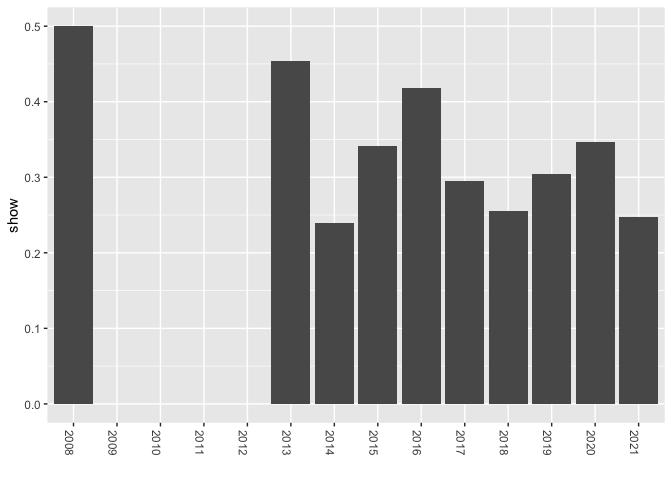

# Netflix Shows

I follow tidytuesday posts and I came across an interesting post about Netlflix Shows. According to their description, in 2018, they released an interesting report which shows that the number of TV shows on Netflix has nearly tripled since 2010. The streaming service’s number of movies has decreased by more than 2,000 titles since 2010, while its number of TV shows has nearly tripled. It will be interesting to explore what all other insights can be obtained from the same dataset.

# Data

The data this week comes from Kaggle w/ credit to Shivam Bansal.

This dataset consists of tv shows and movies available on Netflix as of 2019. The dataset is collected from Flixable which is a third-party Netflix search engine.

Integrating this dataset with other external datasets such as IMDB ratings, rotten tomatoes can also provide many interesting findings.


```r
# required packages
library(tidyverse)
library(lubridate)
library(plyr)

# data from the tidytuesday repository 
netflix_titles <- readr::read_csv('https://raw.githubusercontent.com/rfordatascience/tidytuesday/master/data/2021/2021-04-20/netflix_titles.csv')

# basic summary statistics
dim(netflix_titles)
```

```
## [1] 7787   12
```

```r
skimr::skim(netflix_titles)
```


Table: Data summary

|                         |               |
|:------------------------|:--------------|
|Name                     |netflix_titles |
|Number of rows           |7787           |
|Number of columns        |12             |
|_______________________  |               |
|Column type frequency:   |               |
|character                |11             |
|numeric                  |1              |
|________________________ |               |
|Group variables          |None           |


**Variable type: character**

|skim_variable | n_missing| complete_rate| min| max| empty| n_unique| whitespace|
|:-------------|---------:|-------------:|---:|---:|-----:|--------:|----------:|
|show_id       |         0|          1.00|   2|   5|     0|     7787|          0|
|type          |         0|          1.00|   5|   7|     0|        2|          0|
|title         |         0|          1.00|   1| 104|     0|     7787|          0|
|director      |      2389|          0.69|   2| 208|     0|     4049|          0|
|cast          |       718|          0.91|   3| 771|     0|     6831|          0|
|country       |       507|          0.93|   4| 123|     0|      681|          0|
|date_added    |        10|          1.00|  11|  18|     0|     1512|          0|
|rating        |         7|          1.00|   1|   8|     0|       14|          0|
|duration      |         0|          1.00|   5|  10|     0|      216|          0|
|listed_in     |         0|          1.00|   6|  79|     0|      492|          0|
|description   |         0|          1.00|  61| 248|     0|     7769|          0|


**Variable type: numeric**

|skim_variable | n_missing| complete_rate|    mean|   sd|   p0|  p25|  p50|  p75| p100|hist  |
|:-------------|---------:|-------------:|-------:|----:|----:|----:|----:|----:|----:|:-----|
|release_year  |         0|             1| 2013.93| 8.76| 1925| 2013| 2017| 2018| 2021|▁▁▁▁▇ |

```r
glimpse(netflix_titles)
```

```
## Rows: 7,787
## Columns: 12
## $ show_id      <chr> "s1", "s2", "s3", "s4", "s5", "s6", "s7", "s8", "s9", "s1…
## $ type         <chr> "TV Show", "Movie", "Movie", "Movie", "Movie", "TV Show",…
## $ title        <chr> "3%", "7:19", "23:59", "9", "21", "46", "122", "187", "70…
## $ director     <chr> NA, "Jorge Michel Grau", "Gilbert Chan", "Shane Acker", "…
## $ cast         <chr> "João Miguel, Bianca Comparato, Michel Gomes, Rodolfo Val…
## $ country      <chr> "Brazil", "Mexico", "Singapore", "United States", "United…
## $ date_added   <chr> "August 14, 2020", "December 23, 2016", "December 20, 201…
## $ release_year <dbl> 2020, 2016, 2011, 2009, 2008, 2016, 2019, 1997, 2019, 200…
## $ rating       <chr> "TV-MA", "TV-MA", "R", "PG-13", "PG-13", "TV-MA", "TV-MA"…
## $ duration     <chr> "4 Seasons", "93 min", "78 min", "80 min", "123 min", "1 …
## $ listed_in    <chr> "International TV Shows, TV Dramas, TV Sci-Fi & Fantasy",…
## $ description  <chr> "In a future where the elite inhabit an island paradise f…
```

The data contains 7787 rows and 12 columns. While only __release_year__ is numeric (but it is nonsense), the rest of the variables come as in character format. 

# Are TV Shows tripled in recent years?

Let's first check the distributions of Movies and TV-Shows across years. In the data set, we have __type__ variable representing whether the record is movie or TV show? However, before that, we need to convert __date_added__ variables into date format. Then we will create a df to plot Movie and TV-Shows distribution


```r
# modifiying date added column
library(lubridate)
netflix_titles <- netflix_titles %>%
        mutate(date = mdy(date_added)) %>%
        mutate(year=year(date)) %>%
        mutate(month=month(date))

# we crate a df for 
trend <- netflix_titles %>%
        filter(!is.na(year)) %>%
        mutate(type=as.factor(type)) %>%
        group_by(type, year) %>%
        dplyr::summarize(count = n())  # plyr package sebebiyle
```

```
## `summarise()` has grouped output by 'type'. You can override using the `.groups` argument.
```

```r
# colors by groups
ggplot(data=trend, aes(x=year, y=count, fill=type)) +
        geom_bar(position="stack",stat="identity", color="black") +
        scale_fill_brewer(palette="Reds") + theme_minimal()+
        xlab("")+
        ylab("")
```

<!-- -->

The graph shows that Netflix started to include TV-Shows after 2013. Before that both the number of movies and tv shows are very few in their repository. Nevertheless, both of them gradually have increased in the following years. We can use stack bar graph to see each of the category more in details. 


```r
# Use position=position_dodge()
ggplot(data=trend, aes(x=year, y=count, fill=type)) +
        geom_bar(stat="identity", position=position_dodge())+
        scale_fill_brewer(palette="Paired")+
        theme_minimal()+
        xlab("")+
        ylab("")
```

<!-- -->

As seen from the grapgh above, the number of TV Show has increased more than movies each year after 2014. To look at it more in details, I pulled records after 2014. 


```r
# Use position=position_dodge()
# year 2014
trend %>%
        filter(year> 2014) %>%
        ggplot( aes(x=year, y=count, fill=type)) +
        geom_bar(stat="identity", position=position_dodge())+
        xlab("")+
        ylab("")
```

<!-- -->

Movies has a lower increase ration compared to TV shows, even the number of new release in 2020 is less than 2019. It seems that the popularity of TV Shows gains more speed and Netflix invests more on it. 

## What their ratio tells us?

However, when we look at the overall records for each year, movies still constitute the main body of the Netflix platform. To illustrate, I first plot the filled bar plot and then calculate their ratio for each year. 


```r
# Bar with fill
ggplot(trend, aes(x=year, y=count, fill= type)) +
        geom_bar(position="fill",stat="identity")+
        scale_fill_brewer(palette="Reds") + theme_minimal()+
        xlab("")+
        ylab("")
```

<!-- -->

The graph shows that if we look at the total Netflix investment for each year, there is not significant difference in movie and tv shows ratio. Even I calculate their ratio and plot it below. 


```r
trend_show <- ddply(trend, .(year), summarise, ratio = sum(count[type == "TV Show"]) / sum(count))

trend_movie <- ddply(trend, .(year), summarise, ratio = sum(count[type == "Movie"]) / sum(count))

total_trend <- as_tibble(cbind(trend_movie, trend_show[,2]) )
names(total_trend) <- c("year", "movie", "show")

g <- ggplot(total_trend, aes(x=year, y= show))
g + geom_point() + geom_smooth(method = "loess") # Add a loess smoothed fit curve
```

```
## `geom_smooth()` using formula 'y ~ x'
```

<!-- -->

```r
# Change the position
# Use position=position_dodge()
ggplot(data=total_trend, aes(x=as.factor(year), y=show)) +
        geom_bar(stat="identity")+
        theme(axis.text.x=element_text(angle = -90, hjust = 0))+
        xlab("")
```

<!-- -->


Overall results show that although the number of TV Shows increase each year gradually, their ratio to movies actually do not change that much. The highest investment was recorded in 2013 (we cannot count 2008 since there were only few movies and tv shows in the Netflix repository) but later it goes back and forth within the ratio of 25-40% for corresponding years. 

# Where the Netflix contents come from?

The total number of record in the Netflix repository is 7787 in this dataset and we can imagine that most of the contents were produced in the USA but how about the other countries? Although I do not know what exactly country column represents but when I checked it, it appears to me that it shows where the movie or TV show were produced because most of the records have more than one country.  

Initially, I created a new column from the __country__ variable by splitting the countries. I pulled the first country from the list and used it as the main source or production country of the movie or Tv shows. 


```r
countries <- netflix_titles %>%
        mutate(countries=str_split_fixed(country, ",", 3)) %>%
        filter(countries!="") %>% # filter NA countries
        mutate(first_country=countries[,1])%>% # selecting the first countries
        group_by(first_country) %>%
        dplyr::summarise( n= n()) %>%
        arrange(desc(n)) %>%
        top_n(10)
```

```
## Selecting by n
```

```r
# plotting the top 10 countries 
ggplot(countries, aes(reorder(x=first_country,-n), y=n), color=blues9) +
        geom_bar(stat = "identity", fill="steelblue")+
        theme_light()+
        theme(axis.text.x=element_text(angle = -90, hjust = 0),
              axis.title.x=element_blank(),
              axis.ticks.x=element_blank(),
              axis.title.y=element_blank())
```

<!-- -->

I know what the Bollywood is but I do not know how the Netflix is populated with Bollywood productions. The USA produced 2883 contents, approximately 37% of the total records. From my perspective, United Kingdom and Canada are the expected countries in the list but Japan is a big surprise for me. 

Finally, I wonder how many contents come from Turkey. I do not follow the same procedure used above because I want to learn how many contents are produced in Turkey whether or not Turkey is the primary country for its production. To do so, I search the whole list of countries and pull contents if Turkey is in the country list. 


```r
turkey <- netflix_titles %>%
        mutate(turkey=str_extract(netflix_titles$country, "Turkey"))%>%
        filter(turkey=="Turkey") %>%
        group_by(rating, type) %>%
        dplyr::summarise( n = n())
```

```
## `summarise()` has grouped output by 'rating'. You can override using the `.groups` argument.
```

```r
# plot
turkey %>%
        ggplot(aes(x= rating, y= n, fill=type))+
        geom_bar(stat = "identity")+
        theme_light()+
        theme(axis.text.x=element_text(angle = -90, hjust = 0),
              axis.title.x=element_blank(),
              axis.ticks.x=element_blank(),
              axis.title.y=element_blank())
```

<!-- -->

It seems that 108 contents were produced in Turkey. Most of the contents are movies while TV-MA categories have more contents, followed by TV-14 and TV-PG. 

Overall, this is a fine hobby exercise and it gives me some background information about what I have in my Netflix package. 


